# Desktop Organizer

A desktop organization application with modular architecture for automatic file management, license monitoring, and program installation.

## Overview

Desktop Organizer provides automated file organization with support for scheduled operations, custom filtering rules, and module-based extensibility. The application uses a single-file architecture with dynamic module loading and shared virtual environment management.

## Features

- **Automated File Organization**: Schedule and automate file cleanup with customizable rules
- **Flexible Configuration**: Configure target drives, file filters, size limits, and scheduling
- **Module System**: Extensible architecture with dynamic module loading
- **Virtual Environment Management**: Shared environment for module dependencies with automatic cleanup
- **License Management**: Track and validate software licenses
- **Program Installation**: Automated software deployment tools

## Architecture

### System Architecture Overview

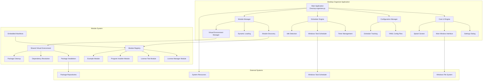

### Core Application (`v4.2.py`)
- Single-file application containing all core functionality
- Main window with tabbed interface for modules
- Configuration management with YAML files
- Scheduled task execution with idle detection

### Module System
- **Embedded Manifests**: Module metadata embedded in Python files
- **Dynamic Loading**: Modules discovered and loaded automatically
- **Shared Virtual Environment**: Isolated dependency management
- **Automatic Cleanup**: Package removal when modules are unloaded

### Available Modules
- `license_manager.py`: License validation and management
- `license_test.py`: License status monitoring
- `program_install.py`: Software installation automation
- `example_module.py`: Reference implementation

### Application Startup Flow

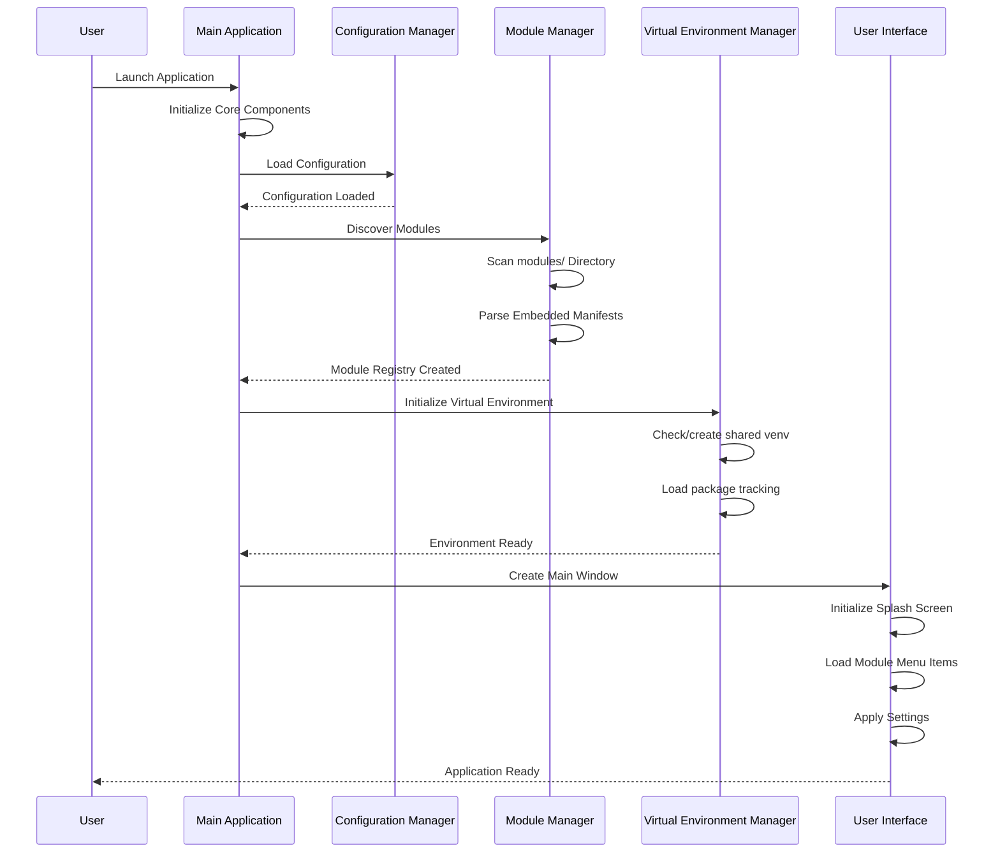

### Module Loading Process

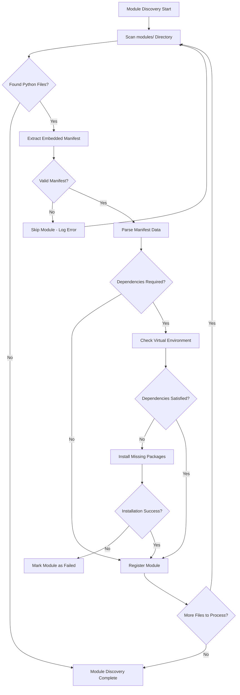

### Virtual Environment Management

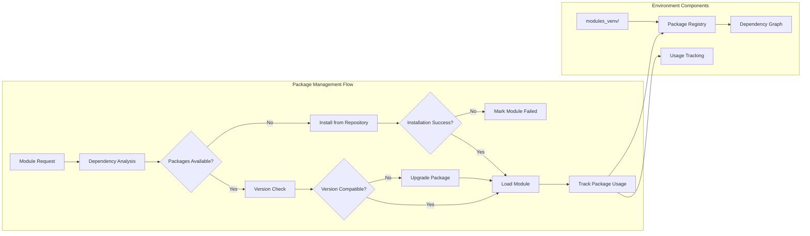

### File Organization Workflow

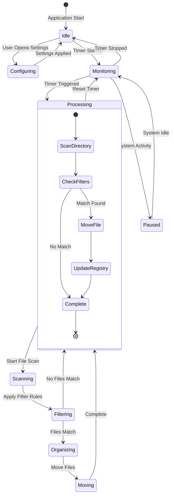

## Installation

### System Requirements
- Python 3.8 or higher
- Windows (recommended for full functionality)
- Administrative privileges for some operations

### Dependencies

Install core dependencies:
```bash
pip install -r requirements.txt
```

### Setup

1. Download or clone the repository
2. Install dependencies from `requirements.txt`
3. Run the application:
   ```bash
   python v4.2.py
   ```

## Usage

### Application Workflow

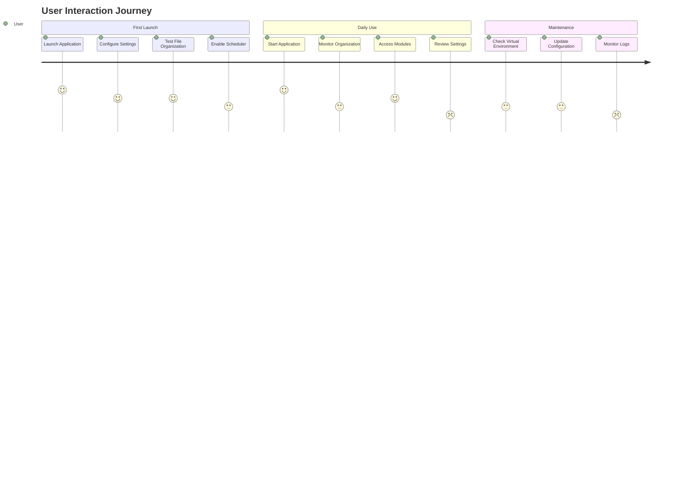

### Main Application
1. **File Organization**:
   - Select target drive (D:, E:, or auto-detect)
   - Configure timer duration
   - Set file filters (extensions, names, size limits)
   - Start automatic or manual cleanup

2. **Settings**:
   - Configure application behavior
   - Set up scheduled operations
   - Manage file filtering rules
   - Control virtual environment settings

3. **Modules**:
   - Access additional functionality through Modules menu
   - Modules load automatically with embedded manifests

### Settings Management Flow

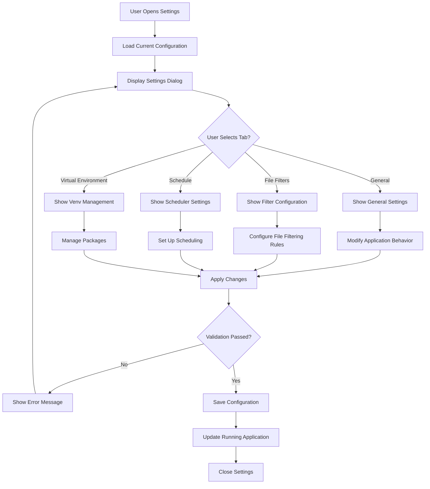

### Configuration

Configuration stored in:
- `~/.DesktopOrganizer/config.yaml`: Application settings
- `~/.DesktopOrganizer/last_run.txt`: Schedule tracking
- `~/.DesktopOrganizer/module_packages.json`: Package usage tracking
- `~/.DesktopOrganizer/modules_venv/`: Shared virtual environment

### Virtual Environment Management

Access through Settings → "Віртуальне Середовище":
- View installed packages
- Monitor package usage by modules
- Clean/reset virtual environment
- Automatic dependency installation/uninstallation

### Package Management Interface

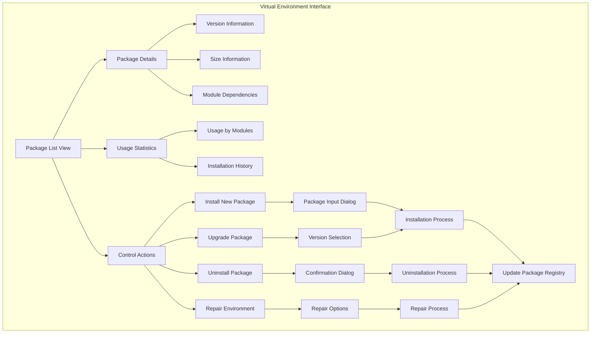

## Module Development

### Module Development Lifecycle

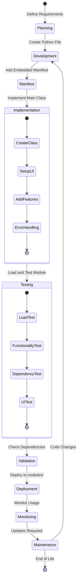

### Creating Modules

1. Create Python file in `modules/` directory
2. Add embedded manifest at top of file:
   ```python
   """MODULE_MANIFEST_START
   {
     "name": "module_name",
     "version": "1.0.0",
     "description": "Module description",
     "menu_text": "&Menu Text...",
     "main_class": "MainClassName",
     "dependencies": ["package>=version"],
     "dependency_packages": {
       "import_name": "pip_package>=version"
     },
     "python_version": "3.8+"
   }
   MODULE_MANIFEST_END"""
   ```

3. Implement main class:
   ```python
   class MainClassName(QWidget):
       def __init__(self, parent=None):
           super().__init__(parent)
           self.setFixedSize(991, 701)
           self.initUI()
   ```

### Module Architecture Pattern

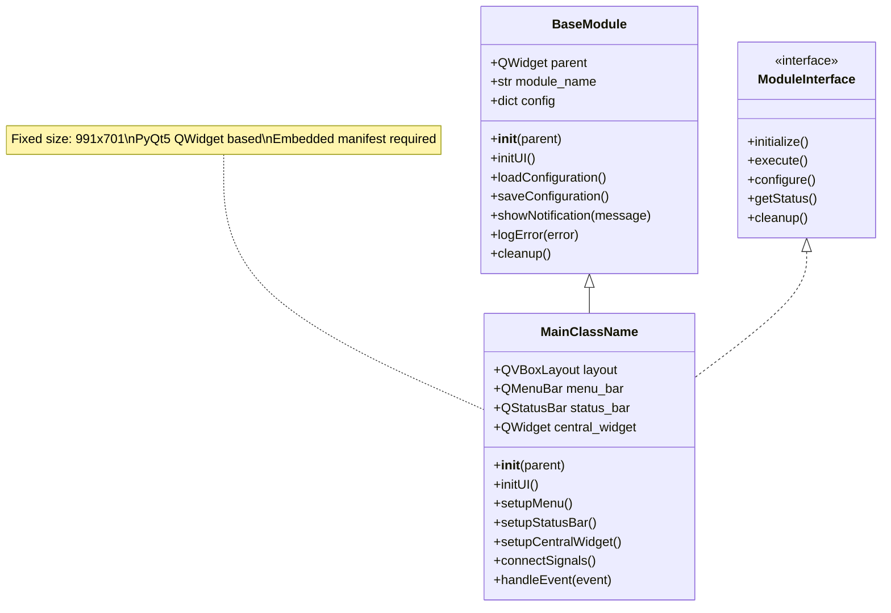

### Module Guidelines

- Window size must be 991x701 pixels
- Include proper error handling
- Use embedded manifests (no separate JSON files)
- List all dependencies in manifest
- Follow PyQt5 best practices

### Module Integration Flow

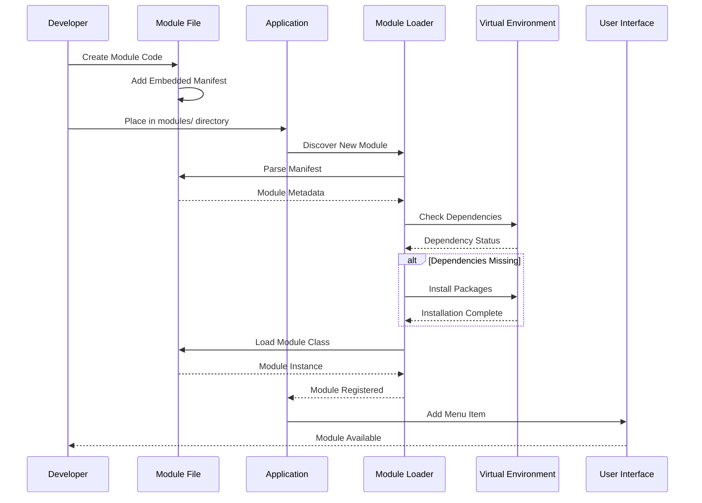

## File Structure

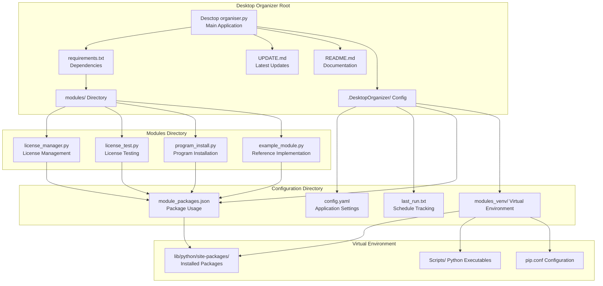

### Detailed Directory Structure

```
Desktop Organizer/
├── Desctop organiser.py              # Main application
├── requirements.txt                  # Core dependencies
├── UPDATE.md                         # Version updates
├── README.md                         # Documentation
├── modules/                         # Module directory
│   ├── license_manager.py           # License management
│   ├── license_test.py              # License checking
│   ├── program_install.py           # Program installation
│   └── example_module.py            # Example module
├── .DesktopOrganizer/               # Configuration directory
│   ├── config.yaml                  # Application settings
│   ├── last_run.txt                 # Schedule tracking
│   ├── module_packages.json         # Package usage tracking
│   └── modules_venv/                # Shared virtual environment
│       ├── lib/python3.x/site-packages/
│       ├── Scripts/
│       └── pyvenv.cfg
└── docs/                           # Documentation
    ├── UPDATE.md
    └── README.md
```

## Troubleshooting

### Troubleshooting Decision Tree

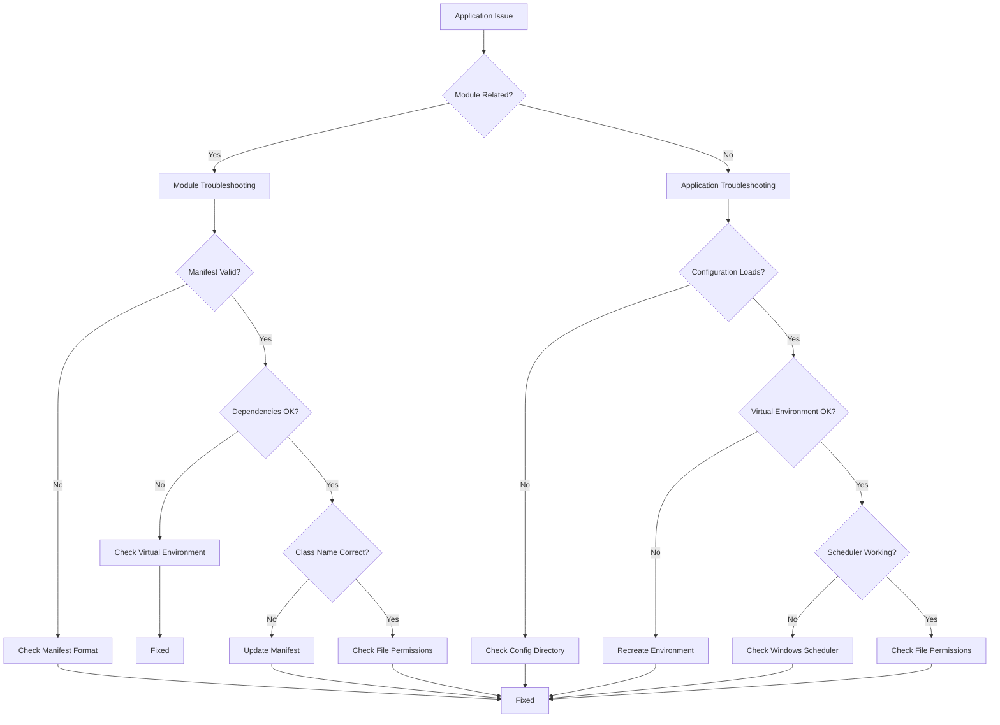

### Common Issues and Solutions

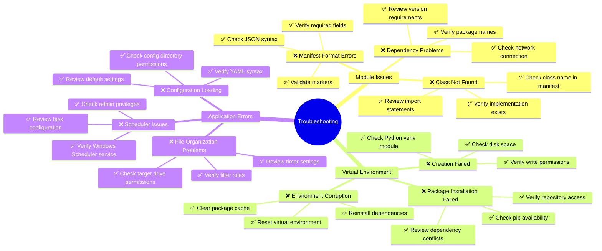

### Debugging Process

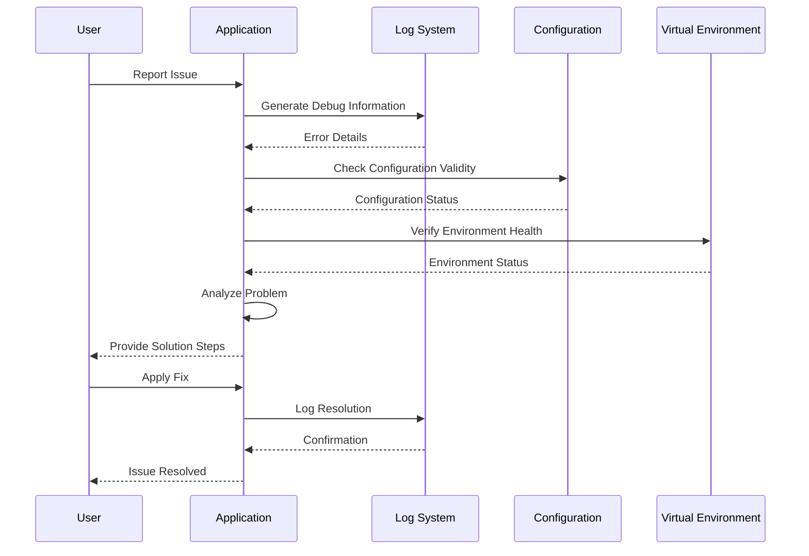

### Module Issues
- Verify embedded manifest format
- Check that Python files are in `modules/` directory
- Ensure main class matches manifest
- Review application log for detailed errors

### Virtual Environment Issues
- Check Python venv module availability
- Verify write permissions in modules directory
- Use Settings → Virtual Environment to diagnose
- Reset environment if package conflicts occur

### Dependency Issues
- Modules auto-install dependencies in shared environment
- Check Settings → Virtual Environment for package status
- Network connectivity required for automatic installation
- Manual installation possible in modules_venv/

## Technical Specifications

### System Architecture

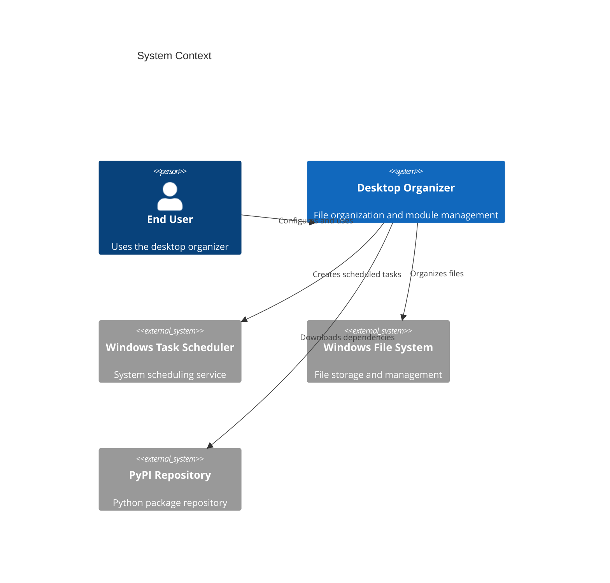

### Technology Stack

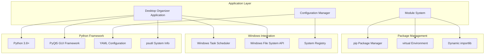

### Performance Requirements

```mermaid
gantt
    title Performance Benchmarks
    dateFormat X
    axisFormat %s

    section Startup Time
    Application Launch   :active, launch, 0, 3s
    Module Discovery    :active, discovery, 0, 2s
    Environment Check   :active, envcheck, 2s, 4s
    UI Ready           :active, ui, 3s, 5s

    section Module Operations
    Module Load        :active, modload, 0, 1s
    Dependency Install :active, depinstall, 0, 30s
    Module Execution   :active, modexec, 0, 0.5s

    section File Operations
    Scan Directory     :active, scan, 0, 5s
    Filter Processing  :active, filter, 0, 2s
    File Organization  :active, org, 0, 10s
```

### Resource Usage

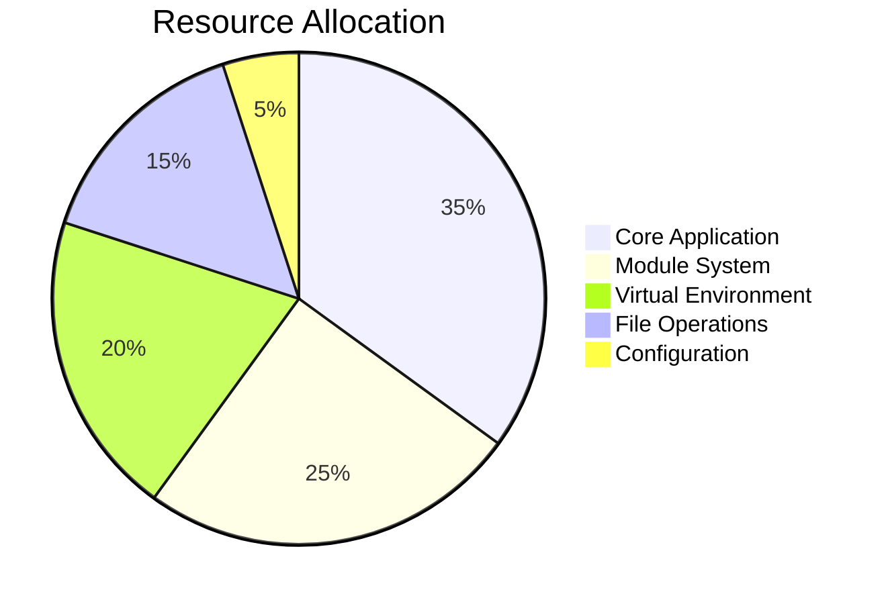

- **Language**: Python 3.8+
- **GUI Framework**: PyQt5
- **Configuration**: YAML
- **System Information**: psutil
- **Module Loading**: Dynamic importlib-based system
- **Package Management**: pip in shared virtual environment
- **Scheduling**: Windows Task Scheduler integration
- **System Requirements**: Windows 7/8/10/11, 100MB disk space, 4GB RAM recommended

## License

Copyright © 2024

See LICENSE.md for license information.

## Support

For technical support:
- Review troubleshooting section
- Check module development documentation
- Examine application logs for error details
- Report issues with system specifications and error messages